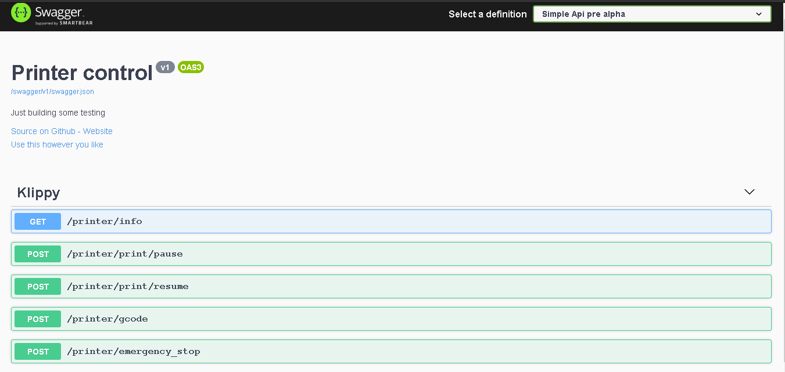

# KApinet
Just a simple hack, trying to implement klipper api communication in dotnet core. Inspired by moonraker.

As of this commit, this is the bear minimal. No actual use for what it is now.

## Why?
Just because
To provide a selft documenting api.
Learn a bit about klipper.
Fun project to get mind out of other things.
Share and play.

---
> **_Note_**
` This is a work in progress that may never be completed.`
---